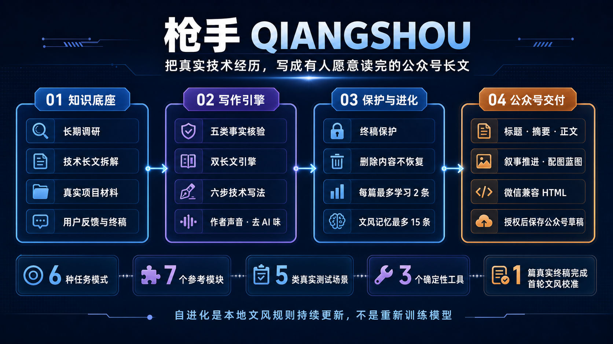

<div align="center">

# 枪手 QIANGSHOU

### 把真实技术经历，写成有人愿意读完的公众号长文

[](https://github.com/powerycy/qiangshou-skill/stargazers)
[](https://github.com/powerycy/qiangshou-skill/releases/tag/v0.1)
[](./qiangshou/SKILL.md)

**如果枪手对你有帮助，请点一个 Star。你的 Star 会帮助更多独立开发者发现它。**



</div>

## 枪手是什么

枪手是一套面向独立开发者、vibecoding和 AI 创作者的中文技术长文 Skill。

它读取仓库、代码、日志、实验、提交记录、用户反馈和作者口述，先建立事实边界，再把真实技术经历写成具有冲突、选择、技术取舍和结果边界的公众号长文。

枪手不是把 README 扩写成文章，也不是用高级词汇覆盖作者原本的表达。

> 它要做的，是保留作者本人，同时让真实技术经历变得可信、好懂，而且有人愿意读完。

## 为什么做枪手

很多技术创作者遇到的并不是“没有内容”，而是：

- 项目事实散落在仓库、日志、实验和聊天记录中；
- 普通 AI 容易把技术项目写成功能说明书；
- 技术内容专业，但普通读者看不懂；
- 为了传播效果，模型容易夸大数据和用户反馈；
- 润色以后，作者的大白话、情绪和判断被磨掉；
- 作者已经确认终稿，AI 仍会主动修改；
- 用户删除或否决的内容，会在下一轮被重新加回来；
- 每写一篇文章，都要重新向 AI 解释自己的文风。

枪手把这些问题变成一条可执行的内容生产管线。

## 核心能力

### 1. 多源材料读取

枪手可以从以下材料建立文章：

- README、许可证和架构文档；
- 关键代码、测试、日志和提交记录；
- 实验数据、图表和时间线；
- 用户口述、评论与反馈；
- 旧稿、参考文章与已确认终稿。

它不会直接扩写材料，而是先寻找事实、主问题、冲突、选择和结果。

### 2. 五类事实核验

重要说法会被区分为：

1. 仓库可验证；
2. 用户亲述；
3. 第三方反馈；
4. 作者推断；
5. 时效数据。

单个反馈不会被包装成普遍效果，局部指标不会被偷换成整体提升，推断也不会伪装成事实。

### 3. 双长文引擎

#### 项目故事

```text
起因与阻力 → 意外上线或失败 → 反馈与冲突 → 技术取舍与反转 → 结果、边界与邀请
```

适合开源项目、产品复盘、技术踩坑和独立开发经历。

#### 观点实证

```text
大众认知 → 作者质疑 → 公平对比 → 意外发现 → 实验验证 → 三步方法 → 价值收束
```

适合用个人经历、实验、数据和权威材料纠正一种流行认知。

### 4. 六步技术写法

```text
问题 → 为什么难 → 尝试与取舍 → 具体实现 → 可量化结果 → 适用边界
```

技术深度来自真实问题、工程决策和结果边界，而不是术语密度。

### 5. 作者声音与去 AI 味

枪手会保留作者自然的大白话、幽默、自嘲、真实情绪和技术判断。

它不会为了“高级感”统一润色，也不会自动添加刻板的技术表达、网络口头禅或模板化金句。专业感来自真实数据、实验和权威材料，正文继续说人话。

### 6. 终稿保护

用户确认“终稿”“发布版”或“最终文案”后：

- 不再主动润色正文；
- 不改变现有文字和顺序；
- 用户删除的内容不得恢复；
- 用户否决的建议不得反复提出；
- 除明确授权的错别字外，只能建议，不能直接修改。

### 7. 轻量自进化

每当用户明确确认一篇终稿，枪手可以对比本轮初稿与终稿：

- 每篇最多学习或修正 2 条文风规则；
- 最多保留 15 条有效规则；
- 重复偏好自动合并；
- 冲突时以作者最新选择为准；
- 用户说“这次不要学习”就跳过。

自进化是本地 `author-voice.md` 文风规则的持续更新，不是重新训练模型。枪手不会把整篇终稿写进记忆，也不会学习文章事实、观点、人物、项目名、奖项和临时结构。

### 8. html交付

根据用户授权范围，枪手可以继续生成：

- 候选标题与摘要；
- 可直接发布的正文；
- 事实说明与待补材料；
- 叙事推进表与配图蓝图；
- 内容冻结排版稿；
- 微信\抖音兼容内联 HTML；
- 经明确授权后保存公众号草稿。

保存草稿不等于发布。未经单独授权，不会群发、发表、提交审核或定时发送。

## 当前能力规模

| 能力 | 当前版本 |
| --- | ---: |
| 任务模式 | 6 种 |
| 参考模块 | 7 个 |
| 真实测试场景 | 5 类 |
| 确定性工具 | 3 个 |
| 长文引擎 | 2 套 |
| 事实类型 | 5 类 |
| 技术写作步骤 | 6 步 |
| 动态文风文件 | 1 份 |
| 单篇终稿学习上限 | 2 条 |
| 文风记忆总上限 | 15 条 |

第一版建立在长期调研、技术长文拆解和多源材料投喂之上。当前公开版本不保存完整范文；已使用 1 篇真实发布终稿完成首轮文风校准，只沉淀可跨文章复用的表达偏好。

## 适合谁

- 有真实项目，却总把文章写成开发日志的人；
- 想写技术公众号，但不想生成标准 AI 文风的人；
- 需要同时兼顾故事、技术、事实和传播的人；
- 希望 AI 逐渐理解个人文风，又不保存整篇终稿的人；
- 经常遭遇“终稿被继续优化”或“删除内容被恢复”的人。

## 与替代方案的区别

| 方案 | 优势 | 常见限制 |
| --- | --- | --- |
| 通用 AI 对话 | 快速生成文字 | 容易模板化，不理解终稿状态 |
| 提示词模板 | 能规范单次输出 | 每篇重新调教，无法沉淀作者偏好 |
| 普通润色工具 | 修改句子快 | 无法建立事实链和技术主线 |
| 人工代笔 | 采访与写作深入 | 成本高、周期长、技术沟通成本大 |
| **枪手** | 事实核验、双长文引擎、终稿保护、自进化与公众号交付 | 仍然需要用户提供真实素材和最终判断 |

## 安装

### 方式一：复制 Skill 文件夹

```bash
git clone https://github.com/powerycy/qiangshou-skill.git
mkdir -p ~/.codex/skills
cp -R qiangshou-skill/qiangshou ~/.codex/skills/qiangshou
```

重新打开 Codex 后即可使用 `$qiangshou`。

### 方式二：仅更新已有版本

```bash
git clone https://github.com/powerycy/qiangshou-skill.git
cp -R qiangshou-skill/qiangshou/. ~/.codex/skills/qiangshou/
```

更新前请自行备份 `references/author-voice.md`。它保存的是你的动态作者文风，直接覆盖会丢失已经学习的规则。

## 快速开始

### 写项目故事

```text
使用 $qiangshou，读取这个项目的仓库、日志和提交记录，
把真实开发过程写成一篇公众号技术长文。
先建立事实边界，再设计主矛盾和文章结构。
```

### 写观点实证长文

```text
使用 $qiangshou，把我的观点、个人经历和实验材料写成观点实证长文。
公平呈现大众认知，区分实验观察、外部研究和作者判断，
允许实验结果与我最初的预期不同。
```

### 保护终稿

```text
这是最终发布版。不要修改正文和顺序，只提出必要建议。
这次终稿可以学习文风，但不要保存文章事实和观点。
```

## 技术架构

```text
Codex 宿主模型
  └── SKILL.md 控制与任务路由
      ├── 7 个按需加载的 Markdown 参考模块
      ├── 双长文引擎与五类事实边界
      ├── author-voice.md 本地规则记忆
      └── 3 个确定性 Python 工具
```

枪手采用渐进式知识加载：主文件负责流程和边界，详细方法按任务读取，减少上下文膨胀和规则冲突。

## 项目结构

```text
qiangshou/
├── SKILL.md
├── agents/
│   └── openai.yaml
├── references/
│   ├── author-voice.md
│   ├── facts-and-strategy.md
│   ├── format-preserving-layout.md
│   ├── review-and-deliverables.md
│   ├── test-scenarios.md
│   ├── wechat-layout-and-draft.md
│   └── writing.md
└── scripts/
    ├── render_wechat_html.py
    ├── validate_wechat_html.py
    └── verify_content_preservation.py
```

## 版本

当前版本：**0.1**

这是第一个公开版本，包含双长文引擎、事实核验、终稿保护、轻量自进化和公众号交付能力。

## 支持枪手

如果枪手帮你完成了一篇文章、保护了一版终稿，或者让技术项目终于有人愿意读完，请点一个 Star。

<div align="center">

### ⭐ Star 是对独立开发最直接的支持

[给枪手一个 Star](https://github.com/powerycy/qiangshou-skill) · [提交问题](https://github.com/powerycy/qiangshou-skill/issues) · [查看版本](https://github.com/powerycy/qiangshou-skill/releases)

</div>
